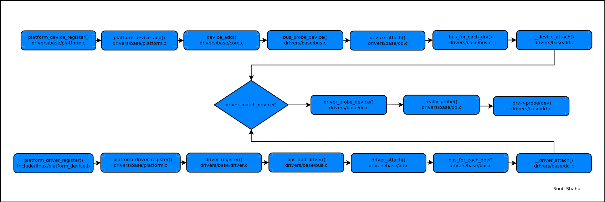

# Driver initialization
{: .no_toc }

## Device tree influence
- ordering of the device nodes, for the same bus, inside the device does not affect the device/driver initialization in the Linux Kernel
- order of the device nodes affects the attribute value overriding in the device tree, but that is not important for this topic

## Linux Kernel module
- using the symbols in one Linux Kernel module is enough to ensure that `modprobe` loads the dependency modules in the right order

## Driver/Device initialization order

## Links and resources
- [The order in which the device-tree text file is written, does it matter?](https://stackoverflow.com/questions/44609713/the-order-in-which-the-device-tree-text-file-is-written-does-it-matter)
- [What is the Linux built-in driver load order?](https://stackoverflow.com/questions/11642330/what-is-the-linux-built-in-driver-load-order)
- [init function invocation of drivers compiled into kernel](https://stackoverflow.com/questions/12865054/init-function-invocation-of-drivers-compiled-into-kernel)
- [What is the difference between module_init and subsys_initcall while initializing the driver?](https://stackoverflow.com/questions/15541290/what-is-the-difference-between-module-init-and-subsys-initcall-while-initializin)
- [How do I define dependency among kernel modules?](https://stackoverflow.com/questions/29717761/how-do-i-define-dependency-among-kernel-modules)
- [Multiple devices using same kernel-module driver](https://www.linuxquestions.org/questions/programming-9/multiple-devices-using-same-kernel-module-driver-4175633647/)

